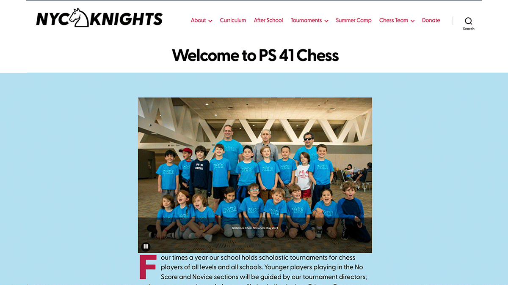
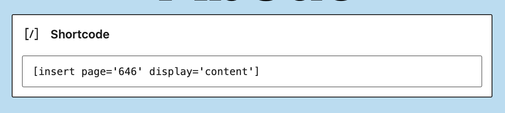
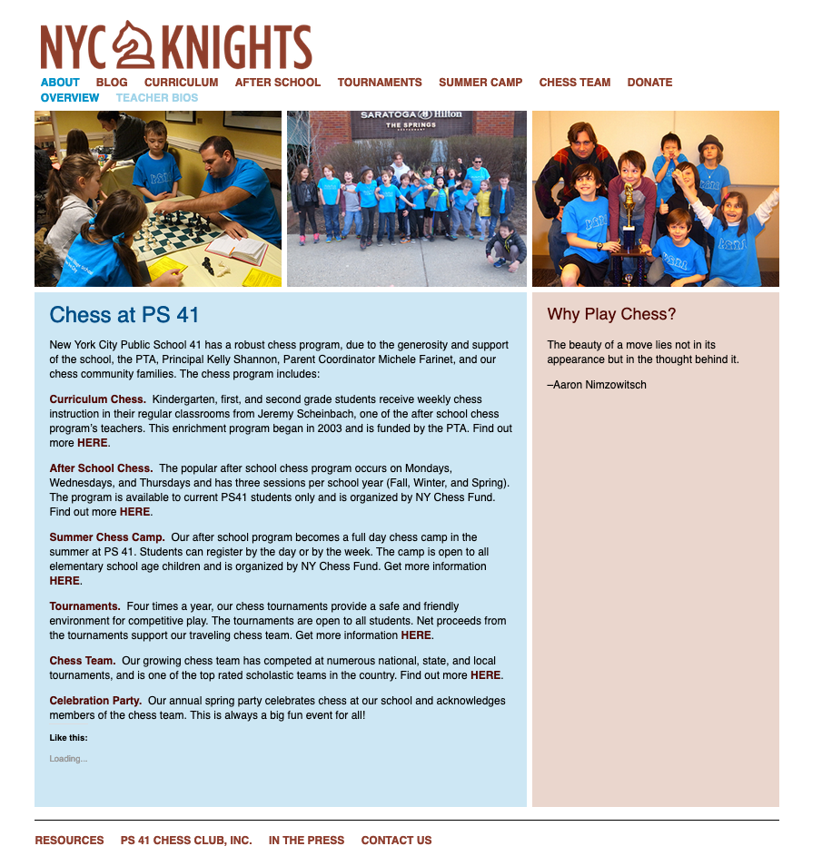

# Note to the next person updating the PS41 chess webpage...

Hi next person or parent updating the PS41 chess webpage. Well, it's on Wordpress, 
I needed to switch templates in 2024 when PHP 7.4 went defunct and the wordpress.com server was updating everything to PHP 8.1.
The template designed 10/15 years ago isn't compatible, I tried updating it, but it was a no go. 

I decided to use a default wordpress template: twenty twenty, and create a child theme for it, in order for updates to be able to be applied to the main theme for the longest time.

I made this GitHub repo so you can access all the code for this child theme, since themes are inacessable in entirety on wordpress.com, even if you ssh into the sever.
https://github.com/ngolebiewski/nyc-knights

All the best and watch out for the 4 move checkmate,

Nick

6-24-2024

# This is a child theme of twenty twenty
- Add image logo for title, and adjust CSS to make it work in the design
- Customize Header menu to drop the "Home" page and pages listed in the Footer.
- Make single column content wider
- Use a webfont from Adobe: https://fonts.adobe.com/fonts/greycliff-cf
- Drop "powered by wordpress" from the footer

# Plugins you need:
- Git Uploader
- Insert Pages
- Meta Slider

# How to install this theme, and keep it updated with github
1. First, install the twenty twenty theme from wordpress, the default theme from 2020.
2. Add the Git Uploader plugin from: https://github.com/jeffkohrman/git-uploader
3. Set it up to use this public repo. 
4. Use ChatGPT or similar for assistance.

# Only use the "twenty twenty" Patterns.

# So you've activated this theme, here are some quirks that you need to know.

# What to do with an empty parent page to display contents from the first child page

- Uses the "Insert Pages" plugin.
  - Go to the page where you want the content from. 
  - Click edit.
  - Note the number that comes up in the URL, i.e. post 747
  - Go to the page where you want the content to show up.
  - Add in a SHORTCODE block
  - write something like this: 
    - [insert page='747' display='content']
    - 
  
# When you activate the theme, go to Customize section under the theme, and add this into "Additional CSS"

```css
h1 {
  font-size: 3em !important;
}

@media (max-width: 700px) {
    h1 {
        font-size: 2em !important;
    }
}

.entry-content > *:not(.alignwide):not(.alignfull):not(.alignleft):not(.alignright):not(.is-style-wide) {
    max-width: 75rem;
    width: calc(100% - 4rem);
}

@media (min-width: 700px) {
    .singular .entry-header {
        padding: 2rem 0;
    }
}

@media screen and (min-width: 700px) {
    .header-titles img.logo-img {
        max-width: 33%; /* Make the logo half-width */
        height: auto; /* Maintain aspect ratio */
    }
    #header-logo {
        max-width: 100%;
        height: auto;
    }
}

/* CSS for adjusting menu positioning */
@media screen and (min-width: 1024px) {
    .header-titles {
        display: flex;
        align-items: center; /* Align items vertically */
        justify-content: space-between; /* Spread items apart */
    }

    .header-navigation-wrapper {
        flex: 1; /* Fill remaining space */
    }
}

/* Default logo styles */
/* .centered-logo {
    display: block;
    margin: 0 auto; /* Center the image horizontally */
    max-width: 100%; /* Ensure the logo doesn't exceed its container's width */
    height: auto; /* Maintain aspect ratio */
} */

/* Media query for adjusting logo size */
@media (max-width: 768px) {
    .centered-logo {
        max-width: 70%; /* Adjust the maximum width as needed */
    }
}

@media (min-width: 1000px) {
    .centered-logo {
        max-width: 100%; /* Ensure the logo doesn't exceed its container's width */
        height: auto; /* Maintain aspect ratio */
    }
    .header-titles-wrapper {
        max-width: 30%;
    }
}
```

# The previous theme
